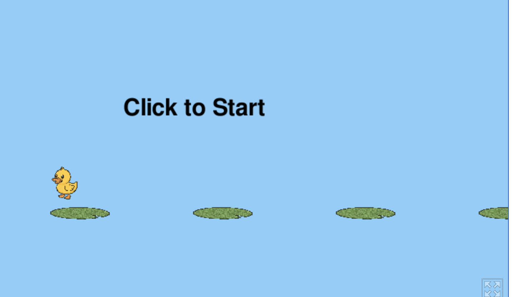

[Play the game on itch.io](https://simostarlord.itch.io)

# 🦆 Louie Duck's Adventure



Join Louie the duck in his splashy, silly, and surprisingly challenging pond-hopping quest!

In this reflex-based jumping game, you’ll help Louie leap across lily pads that move endlessly across the screen. Miss a pad and it’s a one-way trip into the water! Time your jumps carefully and see how long you can keep Louie afloat.

## 🕹️ How to Play
- Click or tap to make Louie jump.
- Land on the next lily pad to keep going.
- If you miss... well, ducks can swim, but not in this game!

## 🎮 Features
- Simple, one-click controls
- Addictive arcade-style gameplay
- Cute visuals with duck and lily pad art
- Increasing difficulty as lily pads scroll faster

Whether you’re in it for a quick play or trying to beat your high score, **Louie Duck’s Adventure** is fun for all ages.

Can you keep Louie hopping?

## 🌐 Web Deployment (pygbag)

To build the web version of **Louie Duck Adventure**:

```bash
# 1. Go to the project folder
cd /Users/caitlinleonard/PycharmProjects/giraffe/pythonProject/duck_jumping_game

# 2. Build the web version with pygbag
pygbag --build main.py

# 3. Create a ZIP of the web build
cd build/web
zip -r louie_duck_adventure.zip .
